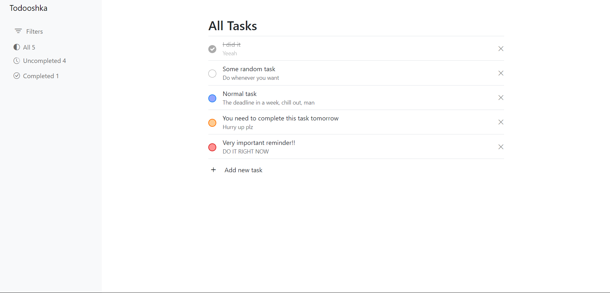
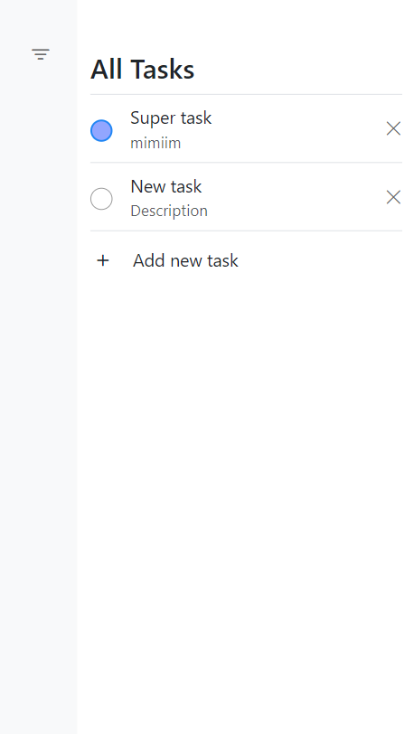

# Todo App

A simple Single Page Application (SPA) for managing your tasks, implemented using JavaScript, HTML, CSS-Bootstrap, and Webpack.

## Features

- **Priority Selection**: Assign priorities to each task.
- **Task Management**: Add, delete, and mark tasks as complete.
- **Task Filtering**: Filter tasks based on their status and priority.
- **Persistent Storage**: Tasks are stored in your browser's local storage, ensuring they persist across sessions.

## Screenshots

## Usage

You can access the live application directly on GitHub Pages: <a href="https://mkh1n.github.io/todo-app/">Todo App</a>

